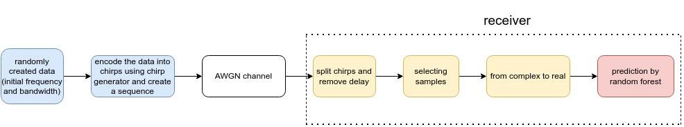
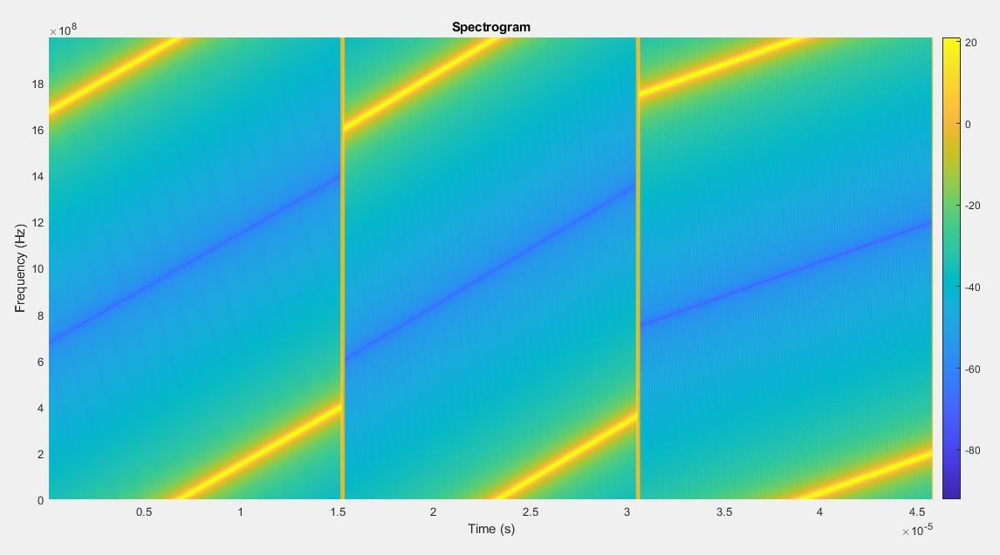

 # Frequency Modulated Continuous Wave  
 
 The aim of this project was to educate radar funtionality
 and the possibility to use them as a **basis for data 
 transmission and receive**. 
 ## Preliminaries 
 An almost 4 hour workshop was provided to present radaring
 operations and a paper about index modulating radars. 
 ## Implementation
 using index modulation methods
 to deliver data on chirp signals,generating random data 
 chirp indexes - transmitting and receiving data considering 
 AWGN channel. 

    

    

## Collabrators

Arman Yazdani: [https://telegram.me/theveryhim]

Iman Ahmadi: [https://telegram.me/imoon_a]

Arya Esfahani: [https://telegram.me/SUT_SUT_SUT]

Mehdi Zolfaghari: [https://telegram.me/Nothingreally_Matters]

Nima Haji: [https://telegram.me/nh_1919]

*Jan 2024 Sharif*
